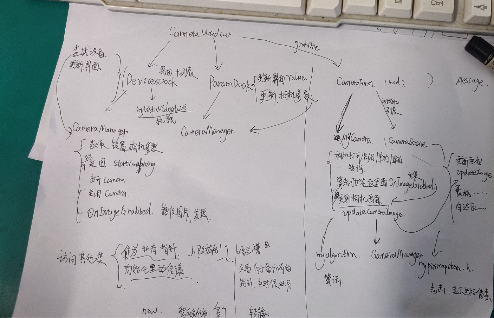

# BaslerCamera
基于Qt的Basler相机操作

代码逻辑：

一个类访问另外一个类的某些属性时（比如子窗口访问父窗口的ui时），可采用两种方式：

以下以其他类在主窗口的TextBrowser中显示信息时为例：

1.  指针： 在每一个类里面建一个QTextBrowser类型的指针，将主窗口的TextBrowser指针一层一层传下来

需要注意的是，指针何时初始化，指针非空，出现野指针的问题。

2. 信号槽：信号槽机制

总结：这两种方法总的来说差不多，都需要传递。但信号槽感觉更加安全。